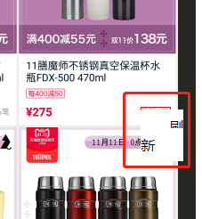
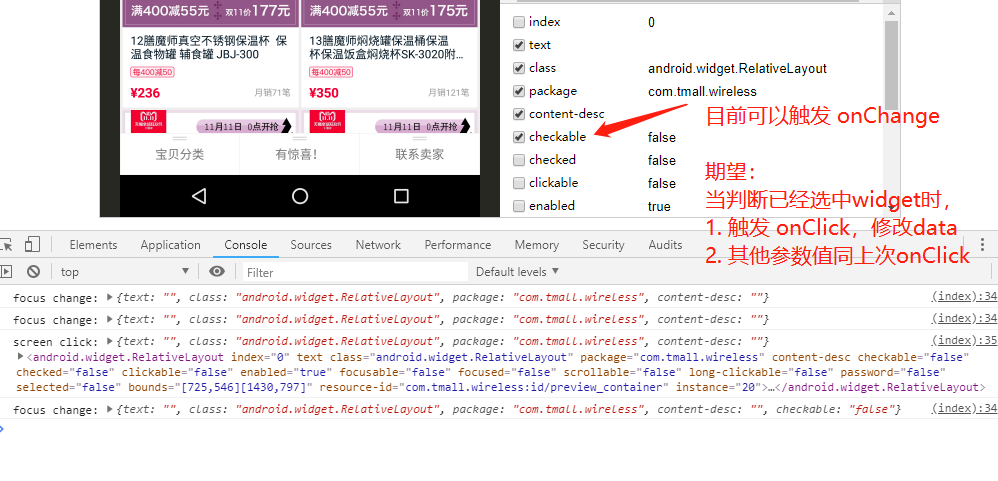

# 待解决问题

* `contextmenu` 定位问题：(紧靠右边的右键菜单因为不能超出显示区域导致BUG)  

* 修改 `columns_checked` 在满足一定条件下触发 `onClick` 事件

## 提交注意事项

1. fork 本仓库到自己github
2. 本地修改提交
3. 发起 `pull request` 到 `flowpp/uiautomator-web` 的 `problem` 分支
4. 等待回应.