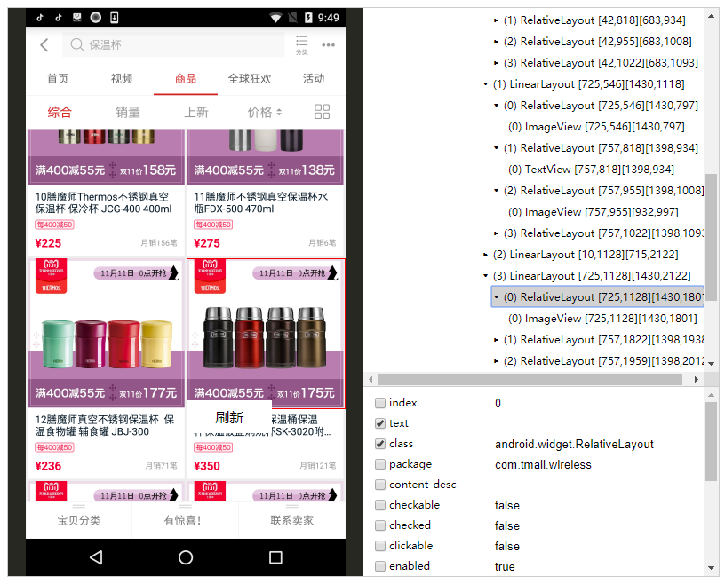

# uiautomator-web
Demo: [https://flowpp.github.io/uiautomator-web/](https://flowpp.github.io/uiautomator-web/)

## Preview


## Interfaces
```ts
export interface Config {
    el?: HTMLDivElement
    loadXML?: () => Promise<Document>
    screenShot?: () => Promise<string>
    onload?: (img: HTMLImageElement) => void
    onerror?: (e) => void
    HEIGHT?: number
    onChange?: (data, node: Element) => void
    onClick?: (e: MouseEvent, data, node: Element) => void
    onInput?: (value: string, data, node: Element) => void
    onSwipe?: (from: MouseEvent, to: MouseEvent, during: number) => void
    columns_enabled?: string[]
    columns_checked?: string[]
    contentmenu?: VNode | string
}
```

## Dev
```
$ npm i
$ npm start
```

## Skills
1. Typescript
2. React/Preact
3. DOM, CSS
